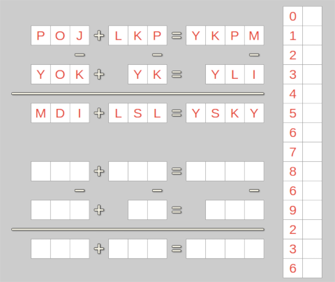
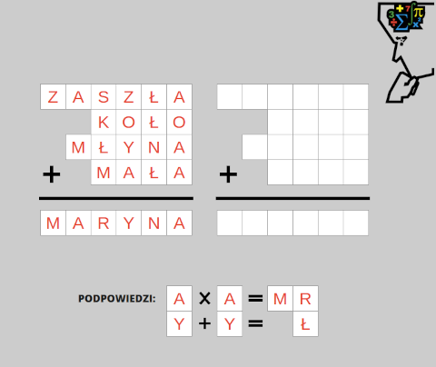

# Algebraf resolver

Script for resolving mathematics puzzles like algebraf and kryptarytm. It`s based on best polish riddle website: https://szarada.net/

### Introducing Algebraf: 

It contains 9 words (e.g. 'POJ', 'LKP') and 6 equations. Every letter in word is linked with a digit.
To resolve algebraf, every letter should be guessed based on equation rules. Some algebraf`s (e.g. above) has also a sentence - on the right side.

### Introducing Kryptarytm:

Like Algebraf - every letters in words are linked with digits. Apart from main equation (in this example - adding) there are often hints (bottom of screen).

## How to use Algebraf resolver

- Executive file: `main.py`
- To resolve puzzle user should uncomment appropriate line (#17 or #18) 
- There are different variables depends on puzzle type

### Resolving Algebraf

- To resolve Algebraf just paste url from https://szarada.net/ directing to specific algebraf (e.g. "https://szarada.net/krzyzowki/pokaz/o-r-r-h-o-b/") to `url` variable
- Script scraps words and equations (based on machine learning - perceptron) from website and resolve algebraf

### Resolving Kryptarytm

- Kryptarytm require different variables
  - `words` - array of Kryptarytm`s words (from top to bottom)
  - `equation` - sign of equation (`+` - adding, `-` - subtraction, `*` - multiplication, `/` - division )  
  - `hint` -  array of arrays - depends on number of hints

## Note

This script is only for educational purposes. Should not be used for collecting points in szarada.net website.  
